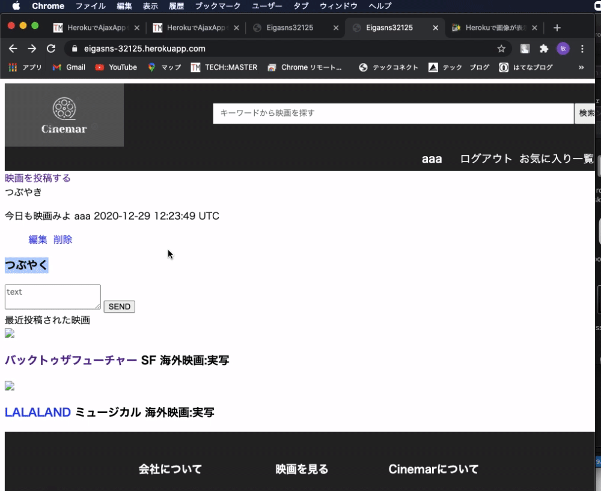

## アプリケーション名	
Cinemar
## アプリケーション概要
映画をメインにしたSNS形式のWEBアプリケーションです。
## URL
https://eigasns-32125.herokuapp.com/
## 利用方法
1.サイト上に評価や確認したい映画をユーザーが投稿します。
2.映画に対して評価やお気に入りします。
3.映画やユーザーと繋がって交流を深めてください。
4.つぶやいたり、フォローしているユーザーとダイレクトメッセージを送ることができます。
## 目指した課題解決
Ruby on railsを使った記述の復習を目指しました。
## 洗い出した要件
・ユーザ登録機能 
・映画ー投稿、詳細確認、編集、評価、検索、お気に入り機能
・つぶやき機能
・フォロー機能
・ダイレクトメッセージ機能
## 実装した機能についてのGIFと説明	
①トップページ上について 
②ユーザーについて
③映画詳細ページについて

## ローカルでの動作方法	 
Ruby 2.6.5,   
Ruby on rails 6.0.3.4,   
Javascript,  
Visual Studio Code
## 課題
ビューにこだわると時間がとてもかかってしまう。
## 工夫した点
ユーザーが交流の場を取れるように意識しました。
→フォローした相手とダイレクトメッセージ、気軽につぶやくことでユーザーの色が出るようにしました。
## 今後増やしたい機能
タグ機能、評価項目追加（カテゴリごとに項目を追加）、ビューを整理
